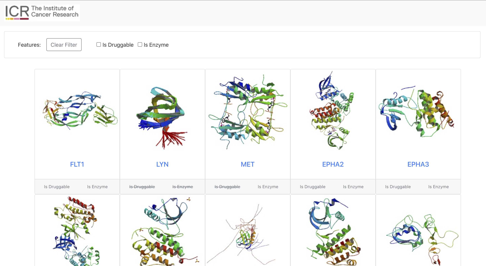
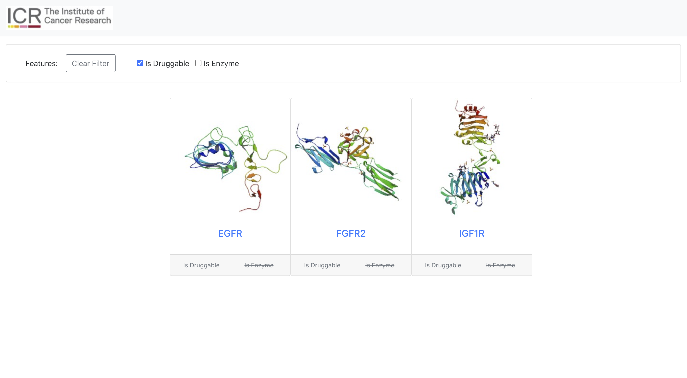
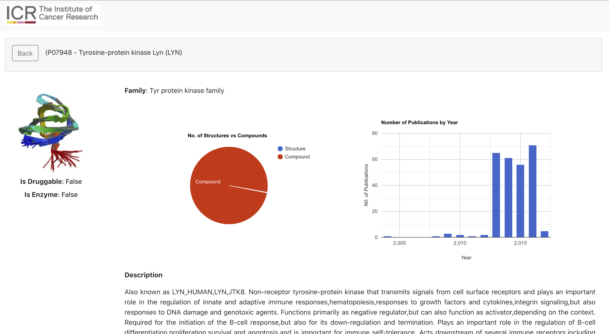

# Institute of Cancer Research

Initial View

Initial View with Filtering

Gene Information View

## Getting Started
The application is connected End-to-End using the following technology stacks:
    
   - Front-end - React
   - Back-end - Node
   - Database - Postgres
    
To run the application using the existing build, run the following command:

        `docker-compose up`
  
In order to build and run the application, run the following command:

        `docker-compose up -build`
        
The UI application will run on:
    [http://localhost:3000/](http://localhost:3000/)
    
The Server (API) will run on the following:
    [http://localhost:3001/api/genes](http://localhost:3001/api/genes)
    
   [http://localhost:3001/api/genes/:id](http://localhost:3001/api/genes/id) E.G: [http://localhost:3001/api/genes/P17948](http://localhost:3001/api/genes/P17948)

## Directory Structure
    File Structure:
        - project_dir/
            - docker-compose.yml (entry point to run the application end-to-end with one command)
            - /node_backend ( NODE BACK END ) - PORT - 3001
                - node_modules
                - utils/
                    - genes.sql (sql statements to set up the USER, DATABASE and TABLE)
                    - routes.js (contains all endpoints)
                - Dockerfile
                - index.js
                
            - postgres ( DATABASE ) - PORT 5432
                - /db_data (tables, configurations and schema files)
                
            - /react_frontend (REACT FRONT END) - PORT 3000
                - Dockerfile
                - public
                    - index.html
                    - manifest.json
                    - Institute_of_Cancer_Research.png
                - src
                    - components
                        - Gene (index.js and styles.css)
                        - Header (index.js and styles.css)
                        - Error (index.js)
                    - page
                        - Genes (index.js and styles.css)
                        - App.js
                        - App.test.js
                    - utils
                        - routes.js
                        - genes.json

## ToDo
- Link Front end to Backend
- Backend - `image` showing as null,
          - `features` - needs to be an object
- Frontend - Link to /:id endpoint for individual gene
- Testing - Jest
- Readme update
